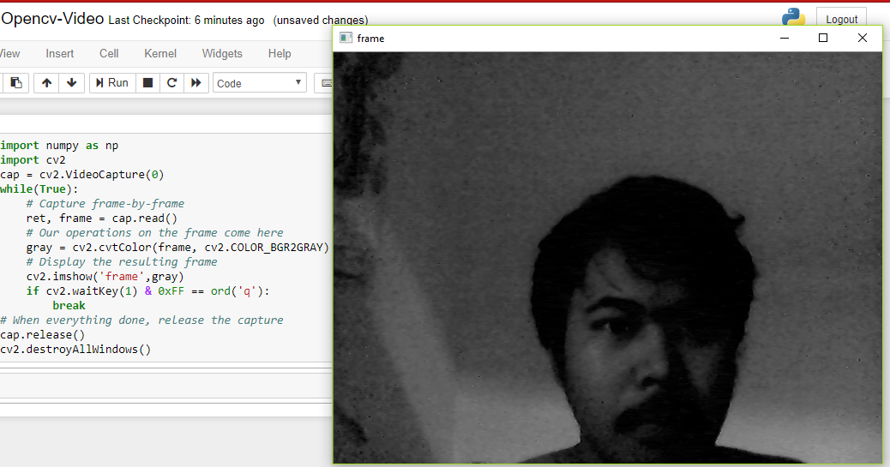

# Grayscale Camera Stream with OpenCV

This Python script captures video from the webcam, converts the frames to grayscale, and displays the video stream in real-time. The video feed continues until the user presses the 'e' key, at which point the program exits gracefully.

## Prerequisites

- Python 3.x
- OpenCV
- NumPy

You can install the required libraries using pip:

```bash
pip install opencv-python numpy
```

## How to Run

1. Ensure that your webcam is properly connected to your computer. <br/>
2. Clone this repository or download the script. <br/>
3. Navigate to the directory containing the script. <br/>
4. Run the script with the following command: <br/>

```bash
python script.py
```

## Results:

- The following is the result of executing the program from scripts.py that was run.



## How It Works

- The script starts by capturing the video feed from the default webcam (camera index 0).
- Each frame of the video is converted to grayscale using OpenCV's cvtColor function.
- The grayscale video stream is displayed in a window titled frame.
- The program will continue running until the user presses the 'e' key, which will stop the video capture and close the display window.

## Customization

- Change the Key for Exiting: You can modify the key to exit the video feed by changing the 'e' in the cv2.waitKey(1) & 0xFF == ord('e') line to another character.
- Change the Video Capture Source: If you want to use a different camera or video file, change the argument passed to cv2.VideoCapture(). For example, to use the second camera on your system, use cv2.VideoCapture(1).

## Code Overview

```python
import numpy as np
import cv2

camera = cv2.VideoCapture(0)

while True:
    ret, img = camera.read()
    gray = cv2.cvtColor(img, cv2.COLOR_BGR2GRAY)
    cv2.imshow('frame', gray)
    if cv2.waitKey(1) & 0xFF == ord('e'):
        break

camera.release()
cv2.destroyAllWindows()

```

## Conclusion

- This script is a simple demonstration of using OpenCV to process and display video in real-time. It can be extended for various applications, such as video surveillance, image processing, and computer vision projects.
"# Grayscale-Camera-Stream-Image-Processing-Real-Time-with-OpenCV" 
